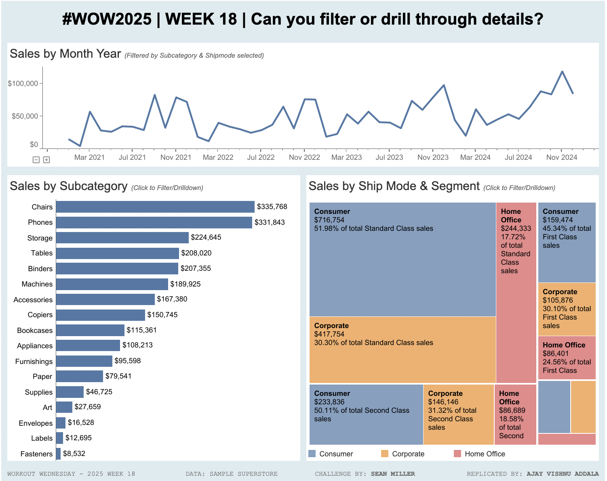

# Workout Wednesday 2025 | Week 18: Can you Filter or Drill to Details?

## Introduction

This repository contains my submission for the Workout Wednesday 2025 | Week 18 challenge, "Can you Filter or Drill to Details?" The challenge leverages Tableau's Dynamic Zone Visibility (DZV) feature to create an interactive dashboard that combines filter actions with detailed drill-down capabilities.

---

## Dashboard Highlights

- **Interactive Monthly Trend of Sales**
- **Sales Analysis by Subcategory**
- **Treemap Visualizing Sales by Segment and Ship Mode**
- **Order Details Table** featuring:
  - Order ID
  - Customer Name
  - Order Date
  - Ship Date
  - Product
  - Sales
  - Profit
  - Profit Ratio
- **Filter Breadcrumb** in the Header
- **Drill to Details** via Tooltip Menu Action

---

## Features Implemented

1. Clicking on any mark in the dashboard filters the entire dashboard.
2. Tooltips include a menu action to "Drill to Details."
3. Details appear dynamically using DZV and retain the scope of previously applied filters.
4. Designed with a responsive layout: **1000×800 pixels.**

---

## Dataset

The dataset used for this challenge is the Sample Superstore dataset. You can [download the dataset here](https://raw.githubusercontent.com/mattyaska/TableauSampleData/main/Sample%20-%20Superstore.xls).

---

## Tableau Dashboard

You can view the published dashboard on Tableau Public: [View Dashboard](https://public.tableau.com/views/CanyoufilterordrillthroughdetailsWOW2025W18/WOW2025W18?:language=en-US&publish=yes&:sid=&:redirect=auth&:display_count=n&:origin=viz_share_link)

---

## How to Use

1. Open the dashboard in Tableau Public or Desktop.
2. Explore the "Monthly Trend of Sales" line chart to see trends over time.
3. Click on marks to filter other dashboard elements.
4. Hover over a mark to see detailed tooltips with a "Drill to Details" menu action.
5. Click "Drill to Details" to dynamically reveal the Order Details table.

---

## Challenge Details

- **Challenge Author**: Sean Miller
- **Challenge Page**: [Workout Wednesday 2025 | Week 18](https://www.workout-wednesday.com/wow2025-week18/)
- **Dataset Source**: [Sample Superstore](https://raw.githubusercontent.com/mattyaska/TableauSampleData/main/Sample%20-%20Superstore.xls)

---
